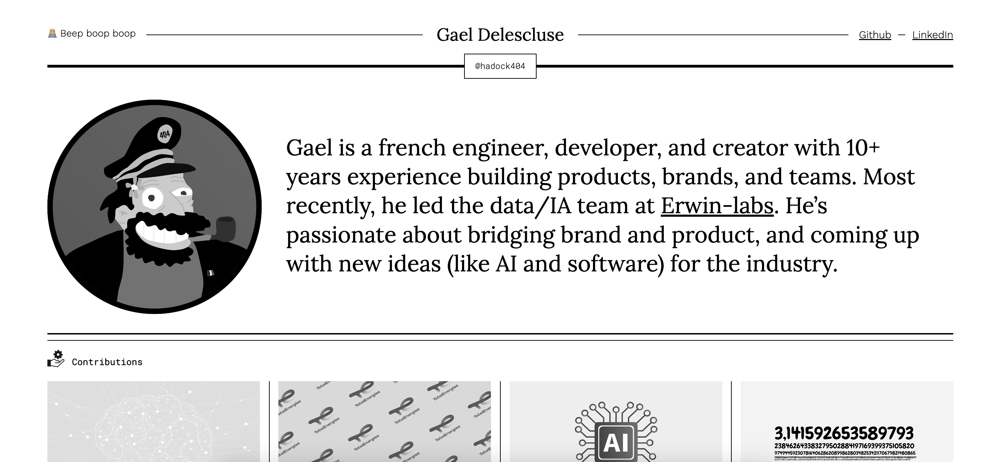

# APP Web Me

[](LICENSE)

Here is my application presenting my work over the years in the field of data science.   

## Description  

An application developed with React that makes it easy to showcase a wide range of projects I've completed throughout my career. Whether it's complex professional projects or personal projects, or even using my hobbies to further my career.  



## Table of Contents

- [Getting Started](#Getting-Started)
- [Launch Application](#Launch-Application)
- [Contributing](#Contributing)
- [License](#License)  

## Getting Started    

```bash
git clone https://github.com/HaDock404/app-web-me.git
cd app-web-me
npm install
```  

## Launch Application    

```bash
npm start
```  

## Contributing

Pull requests are welcome. For major changes, please open an issue first
to discuss what you would like to change.

Please make sure to update tests as appropriate.

## License  

This project is licensed under the MIT License - see the [LICENSE](./LICENSE) file for details.